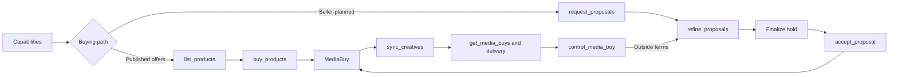

Sam Adeyemi is a senior media buyer at Pinnacle Agency. His client just
greenlit a USD 50,000 Q2 campaign for Acme Outdoor—premium video and display
across sports and outdoor lifestyle publishers. Three sellers to evaluate.
Creatives to match. A governance review before anything goes live.

Last time he ran a campaign this size, it took two weeks, four dashboards, and
a spreadsheet to compare plans that were never in the same format. This
walkthrough follows the same campaign through the AdCP 3.2 proposal lifecycle.

## First choose the buying path

Sam's agent reads `get_adcp_capabilities.media_buy.lifecycle_tools` before
planning. AdCP 3.2 exposes two distinct commercial paths:

| Path | Use it when | Lifecycle |
|---|---|---|
| Published offer | The buyer can select and price a seller's published products directly | `list_products` → `buy_products` |
| Seller-planned proposal | The seller should curate, price, or negotiate a plan from the brief | `request_proposals` → `refine_proposals` → finalize → `accept_proposal` |

Wholesale mirrors use the published-offer path: `list_products` bootstraps and
repairs the feed, while account-level product webhooks keep it current. They are
not proposal conversations. See [Product discovery and planning](/docs/media-buy/product-discovery/)
for both paths.

StreamHaus advertises the proposal lifecycle, so Sam asks its sales agent—built
by Priya Nair's ad products team—to plan the campaign.

## Step 1: Request proposals


Sam keeps strategy and goals in the brief. Exact commercial filters and
delivery constraints use structured criteria:

```javascript
const proposals = await Promise.all(
  sellers.map((seller) =>
    seller.requestProposals({
      adcp_version: '3.2-beta.9',
      idempotency_key: 'acme-q2-proposals-001',
      account: { account_id: 'account_123' },
      brand: { domain: 'acme-outdoor.example' },
      brief:
        'Premium video and display on trusted sports and outdoor lifestyle properties for the Acme Outdoor Q2 launch. Prioritize reach within a USD 50,000 ceiling.',
      criteria: {
        offer_filters: {
          channels: ['olv', 'display'],
          pricing_currencies: ['USD'],
        },
        targeting_overlay: {
          geo_countries: ['US', 'CA'],
          demographics: {
            age: { min: 25, max: 54, include_unknown: false },
          },
        },
      },
    })
  )
);
```

One brief. Three sellers. The same structured constraints, proposal shape, and
task lifecycle everywhere.

<Accordion title="Agency language → AdCP 3.2 terms">

| What Sam says | What the protocol calls it |
|---|---|
| Campaign brief | `brief` on `request_proposals` |
| Exact product constraint | `criteria.offer_filters` |
| Exact delivery targeting | `criteria.targeting_overlay` |
| Targeting dimension chosen later | `criteria.required_overlay_support` |
| Seller-authored media plan | Immutable proposal snapshot |
| Inventory reservation | Committed proposal with `expires_at` |
| IO / insertion order | `accept_proposal`, optionally with `io_acceptance` |
| Operational campaign change | `control_media_buy` inside accepted terms |
| Commercial amendment | Revise the accepted proposal, finalize, then accept |
| Campaign report | `get_media_buy_delivery` |

</Accordion>

## Step 2: Compare and refine


Draft proposals return priced purchases, flight dates, forecasts, targeting
resolution, and canonical creative format options. Sam can compare them without
normalizing seller-specific spreadsheets.

| Seller | Plan | CPM | Forecast | Format |
|---|---|---|---|---|
| StreamHaus | Premium sports video | $28 | 890K impressions | SSAI 30s video |
| OutdoorNet | Adventure display | $12 | 2.1M impressions | 300x250, 728x90 |
| PodTrail | Outdoor podcast | $22 | 340K impressions | Audio 30s + companion |

Sam wants guaranteed delivery and a lower CPM ceiling. He creates a successor
draft with typed constraints:

```javascript
const refined = await streamHaus.refineProposals({
  adcp_version: '3.2-beta.9',
  idempotency_key: 'acme-q2-refine-001',
  refinements: [
    {
      proposal_id: 'proposal_streamhaus_001',
      action: 'revise',
      constraints: {
        total_budget: { max: 50000, currency: 'USD' },
        cpm: { max: 25, currency: 'USD' },
      },
      ask: 'Keep guaranteed delivery and prioritize completed video views.',
    },
  ],
});
```

Typed constraints are mechanically testable. Subjective commercial guidance
stays in `ask`. Each transition creates a new `proposal_id`; the source
snapshot never changes. Sam branches on each result's `outcome` and verifies
any `partial` result before continuing.

## Step 3: Check creative requirements


Every proposed product declares canonical `format_options[]`. Sam's platform
can therefore validate or produce assets before accepting commercial terms:

- StreamHaus needs SSAI-compatible 30-second video.
- OutdoorNet needs 300x250 and 728x90 images.
- PodTrail needs 30-second audio plus a companion image.

Sam's creative team already has the video and display assets. The platform
flags the missing audio cut early, while the proposal is still negotiable.
Creative bodies do not belong in `buy_products` or `accept_proposal`; they are
supplied through the seller's advertised creative workflow after commitment.

## Step 4: Finalize and accept


Once the terms are right, Sam finalizes the selected draft. Finalization
creates a committed successor and an inventory hold:

```javascript
const finalized = await streamHaus.refineProposals({
  adcp_version: '3.2-beta.9',
  idempotency_key: 'acme-q2-finalize-001',
  refinements: [
    {
      proposal_id: 'proposal_streamhaus_002',
      action: 'finalize',
    },
  ],
});
```

Sam verifies the committed proposal's `terms_digest` and `expires_at`, then
accepts that exact snapshot:

```javascript
const buy = await streamHaus.acceptProposal({
  adcp_version: '3.2-beta.9',
  idempotency_key: 'acme-q2-accept-001',
  account: { account_id: 'account_123' },
  proposal_id: 'proposal_streamhaus_003',
  proposal_terms_digest: 'sha256:Fy6Bo7wUa_FmXGJssc37kGyHNjzBiBZLB9rtVNz8I-E',
});
```

The ID and digest bind acceptance to the reviewed terms. If the task enters
`submitted`, `working`, or `input-required`, Sam follows the standard task
lifecycle until the completion artifact returns the `media_buy_id`.

## Step 5: Governance and creative supply


Pinnacle registers the campaign plan with `sync_plans` and checks the proposed
acceptance against Jordan Ochoa's governance policy. Budget, approved sellers,
targeting rules, and creative provenance are evaluated before money moves.
Seller-side governance can independently validate the committed action against
the same plan context.

After acceptance, Sam supplies the assets through `sync_creatives` and assigns
them to the returned packages. The buy remains `pending_creatives` until every
required format has coverage, then moves to `pending_start` or `active`.

<Accordion title="A library-backed creative sync">

```javascript
await streamHaus.syncCreatives({
  adcp_version: '3.2-beta.9',
  idempotency_key: 'acme-q2-creatives-001',
  account: { account_id: 'account_123' },
  creatives: [
    {
      creative_id: 'video_30s_trail_pro',
      name: 'Trail Pro 3000 — 30s CTV spot',
      format_kind: 'video_hosted',
      assets: {
        video_main: {
          asset_type: 'video',
          url: 'https://cdn.pinnacle-agency.example/trail-pro-30s.mp4',
          width: 1920,
          height: 1080,
          duration_ms: 30000,
          container_format: 'mp4',
          codec: 'h264',
        },
      },
    },
  ],
  assignment_operations: [
    {
      operation: 'assign',
      creative_id: 'video_30s_trail_pro',
      package_id: buy.packages[0].package_id,
    },
  ],
});
```

</Accordion>

## Step 6: Match at serve time

When a user loads a StreamHaus surface, its Trusted Match router can evaluate
which packages should activate. Context Match asks whether the content fits
the package; Identity Match asks whether the user is eligible. The publisher
joins the two responses locally, so Sam's buyer agent does not receive identity
and page context together.

See [Trusted Match Protocol](/docs/trusted-match) for the privacy architecture
and surface-specific flows.

## Step 7: Monitor and control delivery


Sam reads operational state and the current revision from `get_media_buys`, and
uses billing-grade `get_media_buy_delivery` for reporting. If he needs to pause
a package or adjust a budget inside the accepted commercial envelope, he uses
`control_media_buy` with the latest revision:

```javascript
const controlled = await streamHaus.controlMediaBuy({
  adcp_version: '3.2-beta.9',
  idempotency_key: 'acme-q2-control-001',
  account: { account_id: 'account_123' },
  media_buy_id: buy.media_buy_id,
  revision: current.revision,
  packages: [
    {
      package_id: current.packages[0].package_id,
      paused: true,
    },
  ],
});
```

If a requested change falls outside accepted terms, the seller returns
`REQUOTE_REQUIRED`. Sam starts an amendment from `accepted_proposal_id`, then
repeats revise → finalize → accept. Operational state and commercial agreement
remain separate and auditable.

## The full picture



Sam still gets one protocol and one operational view across sellers, but 3.2
makes the commercial intent explicit: published offers are purchased directly;
seller-planned terms move through immutable proposals; live delivery is changed
with revision-checked controls.

## Continue

- [Product discovery and planning](/docs/media-buy/product-discovery/) — choose
  published offers, wholesale mirroring, or proposals
- [Proposal negotiation](/docs/media-buy/product-discovery/proposal-negotiation)
  — implement immutable revisions and holds
- [Media buy lifecycle](/docs/media-buy/media-buys/lifecycle) — state,
  creatives, controls, and delivery
- [3.1 → 3.2 migration](/docs/reference/migration/3-1-to-3-2) — isolate the
  compatibility facade behind capability-driven adaptation
