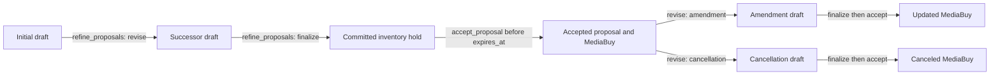

AdCP 3.2 proposal negotiation is an immutable-snapshot workflow. Buyers express mechanically verifiable requirements as typed fields and reserve `ask` for commercial nuance. Sellers validate the complete request before mutation, then return one independently classified result for each source proposal.

This guide uses one scenario throughout: Sam, a buyer agent acting for Pinnacle Agency, is negotiating an Acme Outdoor campaign with the StreamHaus sales agent.

## Lifecycle



Every transition creates a new `proposal_id`; the source snapshot remains unchanged. Every successor returned by [`refine_proposals`](/docs/media-buy/task-reference/refine_proposals) carries `parent_proposal_id` equal to the source ID. A buyer can therefore reconstruct negotiation and amendment history by walking the parent chain.

`draft` terms are indicative and do not reserve inventory. `finalize` copies an unchanged draft into a `committed` snapshot and creates a hold until `expires_at`. [`accept_proposal`](/docs/media-buy/task-reference/accept_proposal) consumes that hold and creates, updates, or cancels the MediaBuy according to `proposal_kind`.

In traditional media terms, this lifecycle is the two-phase avails check. A draft is a **soft avail**: the seller answers from models or cached inventory state, forecasts carry `valid_until` freshness bounds, and nothing is reserved — another buyer can take the inventory before this one commits. `finalize` is where the **firm avail** runs: the seller hits its inventory system, re-prices if needed, and either takes the hold or fails the finalize. Draft numbers are therefore non-binding, and a finalize returning different pricing or forecast values than its source draft showed is correct behavior, not an error. Buyers that need certainty across a slow approval chain hold inventory by finalizing early — not by polling discovery for fresher snapshots.

## Discover what the seller supports

Read `get_adcp_capabilities.media_buy.lifecycle_tools` before selecting the compact lifecycle. A negotiating seller includes `refine_proposals`; it may also publish `media_buy.proposal_refinement`:

For product design and adopter communication, these capability sets are useful shorthand:

| Capability set | Typical advertised tools | What a client can safely claim |
|---|---|---|
| Proposal exploration | `request_proposals`, optionally `refine_proposals` and `decline_proposals` | Request, compare, and negotiate seller-authored proposals; no executable purchase is implied. |
| Executable proposal lifecycle | `request_proposals`, `refine_proposals`, and `accept_proposal` | Negotiate, create a seller-backed hold through finalization, and consume accepted terms into a MediaBuy. |
| Direct purchase | `list_products` and `buy_products` | Read a wholesale offer feed and buy an eligible published offer without proposal negotiation. |
| Campaign operations | `control_media_buy` | Operate an existing MediaBuy within its accepted rights and current state. |

These labels are non-normative adopter shorthand, not new conformance profiles. The advertised `lifecycle_tools` array remains authoritative, and buyers must inspect the individual tools rather than infer support from a label. In particular, a proposal-exploration implementation must not claim executable acceptance unless the seller also exposes the hold and acceptance path.

| Dimension | Request field | Mechanical promise |
|---|---|---|
| `total_budget` | `constraints.total_budget` | Validate a present total, matching currency, and inclusive bounds. |
| `cpm` | `constraints.cpm` | Validate every purchase as fixed CPM/vCPM in the requested currency at or below the ceiling; auction and non-CPM pricing are unsatisfied. |
| `impressions` | `constraints.impressions` | Validate that every purchase has a concrete impression volume and their sum meets the inclusive floor. |
| `flight` | `constraints.flight` | Validate concrete timestamps against `start_no_later_than` and `end_no_earlier_than`; an `asap` start cannot satisfy a start bound. |
| `product_changes` | `product_changes` | Validate keyed `include` and `omit` actions against returned purchases. |
| `alternatives` | `alternatives.count` | Return distinct commercial terms up to the advertised `max_alternatives`. |
| `criteria` | `criteria` | Parse and replace structured discovery criteria. |

An explicit `supported_dimensions: []` means ask-only refinement. An omitted `proposal_refinement` block means typed support is unknown, so the buyer must tolerate per-result `partial` or `unable` outcomes.

When an explicit list omits a dimension, the buyer SHOULD remove or translate that field before sending. If it sends the field anyway, the seller MUST reject the entire task with `UNSUPPORTED_FEATURE` before creating any successor. Free-text interpretation is competence, not a capability dimension; `ask` remains available even when the list is empty.

When the seller interprets hard targeting found only in `ask` and that interpretation materially affects eligibility, pricing, or forecasting, inspect the result's `targeting_resolution.brief_targeting`. Structured `criteria.targeting_overlay` is not echoed when accepted exactly; any product-specific departure remains a sparse `Product.targeting_resolution.modifications` proposal that the buyer must review.

## Two failure planes

Do not flatten task errors and negotiation outcomes into one exception type.

| Plane | Examples | Mutation rule | Buyer action |
|---|---|---|---|
| Task-level error | Malformed payload, more than 25 refinements, duplicate source IDs, count above 10 or `max_alternatives`, explicitly unsupported dimension, unauthorized source | No sibling may mutate | Correct the whole request and retry with a new key. |
| Per-proposal outcome | `revised`, `partial`, `unable`, `finalized` | One ordered result per source; revision outcomes are independent | Verify the typed result, then select, revise, finalize, or decline. |
| Atomic finalize outcome | `finalized`, `hold_unavailable`, `batch_aborted` | Every hold is created or none are | Retry the exact batch only for an exact replay; otherwise form a new request. |

`constraint_unsatisfiable` means the seller accepted the dimension but did not satisfy it. `unsupported_dimension` is used per proposal only when capabilities were unknown; an explicitly omitted dimension is a task-level `UNSUPPORTED_FEATURE`. `commercially_declined` applies only to `ask`, never to a typed constraint.

For example, if StreamHaus explicitly omits `criteria`, the task fails before any proposal is created:

```json
{
  "$schema": "/schemas/core/protocol-envelope.json",
  "status": "failed",
  "adcp_error": {
    "code": "UNSUPPORTED_FEATURE",
    "message": "This seller does not support criteria refinement.",
    "field": "refinements[0].criteria",
    "recovery": "correctable",
    "details": {
      "unsupported_dimension": "criteria",
      "supported_dimensions": ["total_budget", "cpm", "alternatives"]
    }
  }
}
```

## Buyer implementation

### 1. Build typed-first requests

Sam requests a USD 50,000 ceiling, a CPM ceiling, US/Canada criteria, a product change, and three distinct alternatives. The prose asks for subjective reach optimization only:

```json
{
  "$schema": "/schemas/media-buy/refine-proposals-request.json",
  "idempotency_key": "typed-negotiation-sam-0001",
  "refinements": [
    {
      "proposal_id": "proposal_streamhaus_001",
      "action": "revise",
      "constraints": {
        "total_budget": { "max": 50000, "currency": "USD" },
        "cpm": { "max": 18, "currency": "USD" },
        "flight": { "end_no_earlier_than": "2026-10-31T23:59:59Z" }
      },
      "product_changes": {
        "premium_video_q4": "include",
        "display_standard_q4": "omit"
      },
      "criteria": {
        "targeting_overlay": { "geo_countries": ["US", "CA"] }
      },
      "alternatives": { "count": 3 },
      "ask": "Use materially different mixes and prioritize reach."
    }
  ]
}
```

Typed fields are hard proposal requirements. Do not copy legacy `get_products.filters.budget_range` into `constraints.total_budget`: the legacy field is a hard product-discovery filter, while the compact field validates the negotiated proposal's `commercial_terms.total_budget` and forces `partial` or `unable` when missed. Legacy `more_like_this` has no typed compact equivalent and maps only lossily to `ask`.

### Legacy budget compatibility (normative)

Budget compatibility has two distinct rules:

- **Discovery range:** Initial [`request_proposals`](/docs/media-buy/task-reference/request_proposals) has no `criteria.constraints.total_budget` field. Its budget field is `request_proposals.criteria.offer_filters.budget_range`. A compatibility adapter MAY project that field to `get_products.filters.budget_range` because both are hard product-discovery filters. The adapter MUST copy every supplied numeric bound and the three-letter currency unchanged, MUST preserve inclusive `min` and `max` boundaries, MUST enforce `min <= max`, and MUST NOT perform currency conversion. If the legacy seller cannot apply the exact currency and bounds, the adapter MUST return the pre-dispatch rejection below rather than approximate the filter.
- **Proposal-term constraint:** An adapter MUST NOT project `refine_proposals.refinements[].constraints.total_budget` to `get_products.filters.budget_range`. The compact constraint is evaluated after proposal generation against each successor's `commercial_terms.total_budget`; the legacy field filters product candidates and does not guarantee any returned proposal's aggregate total. Identical `{min,max,currency}` syntax does not make those evaluation targets equivalent. Dropping the constraint, converting currency, changing a boundary, placing it in `ask`, or returning an out-of-range proposal with a warning would all weaken the buyer's hard requirement.

These rules are lifecycle-specific. The discovery projection is valid for an initial `request_proposals` compatibility call. On a revision, a present `criteria.offer_filters` replaces that entire criterion from the source proposal; it is not a subfield delta. The adapter MUST project the complete replacement object to legacy absolute `filters`, or reject before dispatch if any field cannot be represented exactly. When `criteria.offer_filters` is omitted, the adapter MUST also omit legacy `filters`, preserving each referenced proposal's bound discovery constraints. This discovery mapping is not a substitute for `constraints.total_budget` on `action: "revise"`.

Compact `action: "finalize"` accepts no constraints and copies the draft's complete `commercial_terms` unchanged into a committed snapshot. Legacy `finalize` asks for firm pricing and therefore does not, by itself, prove unchanged terms. An adapter MAY project finalize only when it can guarantee that the legacy operation preserves the complete commercial terms, not merely the total budget. Otherwise it MUST reject before dispatch rather than compare or repair terms after mutation.

Every unsupported compact-to-legacy case above returns the same typed local compatibility result:

```typescript
type PreMutationUnsupported = {
  code: 'PRE_MUTATION_UNSUPPORTED';
  unsupported_fields: Array<{
    path: string; // RFC 6901 JSON Pointer rooted at the compact request
    reason: 'NO_LOSSLESS_LEGACY_MAPPING';
    lost_guarantee:
      | 'exact_discovery_offer_filter_state'
      | 'proposal_total_budget_constraint'
      | 'immutable_finalize_terms';
  }>;
  recovery: 'USE_COMPACT_LIFECYCLE' | 'REFORMULATE_REQUEST';
  dispatched: false;
};
```

For example, the first refinement's hard budget constraint uses `/refinements/0/constraints/total_budget`; an unsafe finalize uses `/refinements/0/action`. `unsupported_fields` MUST contain every incompatibility detected during preflight, and any entry rejects the whole operation before a network request or mutation. `PRE_MUTATION_UNSUPPORTED` is not an AdCP wire error code. SDKs MAY express the type idiomatically in each language, but MUST preserve these discriminator values, JSON Pointer paths, lost-guarantee identifiers, recovery choices, and `dispatched: false`. An explicit caller opt-in to lossy projection does not make the mapping conformant.

A fully satisfied revision returns new immutable drafts and no failure prose:

```json
{
  "$schema": "/schemas/media-buy/refine-proposals-response.json",
  "status": "completed",
  "results": [
    {
      "source_proposal_id": "proposal_streamhaus_001",
      "outcome": "revised",
      "proposals": [
        {
          "proposal_id": "proposal_streamhaus_002a",
          "parent_proposal_id": "proposal_streamhaus_001",
          "proposal_kind": "new_media_buy",
          "proposal_status": "draft",
          "name": "Acme Outdoor — premium video",
          "commercial_terms": {
            "brand": { "domain": "acmeoutdoor.example" },
            "purchases": [
              {
                "product_id": "premium_video_q4",
                "pricing_option_id": "cpm_guaranteed",
                "pricing": {
                  "pricing_option_id": "cpm_guaranteed",
                  "pricing_model": "cpm",
                  "currency": "USD",
                  "fixed_price": 18
                },
                "start_time": "2026-10-01T00:00:00Z",
                "end_time": "2026-11-01T00:00:00Z"
              }
            ],
            "start_time": "2026-10-01T00:00:00Z",
            "end_time": "2026-11-01T00:00:00Z",
            "total_budget": { "amount": 50000, "currency": "USD" }
          },
          "terms_digest": "sha256:Fy6Bo7wUa_FmXGJssc37kGyHNjzBiBZLB9rtVNz8I-E"
        }
      ]
    }
  ],
  "products": []
}
```

### 2. Branch on the discriminated result

Handle `outcome` before reading proposal fields:

| Outcome | Read | Required verification |
|---|---|---|
| `revised` | `proposals[]` | Every requested typed constraint and product action is satisfied. The array has one item unless alternatives were requested, in which case it has the exact requested count. |
| `partial` | `proposals[]`, `reason_code`, `unsatisfied_constraints`, `unsatisfied_product_changes` | Every returned draft satisfies every constraint and product action *not* listed as unsatisfied. |
| `unable` | `reason_code`, machine-readable unsatisfied fields | No proposal was produced; never access `proposal` or `proposals`. |
| `finalized` | singular `proposal` | Status is `committed`, parent is the source draft, and `expires_at` leaves enough time to accept. |

A valid counteroffer with only two of the three requested alternatives is `partial`:

```json
{
  "$schema": "/schemas/media-buy/refine-proposals-response.json",
  "status": "completed",
  "results": [
    {
      "source_proposal_id": "proposal_streamhaus_001",
      "outcome": "partial",
      "reason_code": "alternatives_unavailable",
      "reason": "Two commercially distinct mixes are available at these terms.",
      "proposals": [
        {
          "proposal_id": "proposal_streamhaus_002a",
          "parent_proposal_id": "proposal_streamhaus_001",
          "proposal_kind": "new_media_buy",
          "proposal_status": "draft",
          "name": "Acme Outdoor — premium video",
          "commercial_terms": {
            "brand": { "domain": "acmeoutdoor.example" },
            "purchases": [
              {
                "product_id": "premium_video_q4",
                "pricing_option_id": "cpm_guaranteed",
                "pricing": {
                  "pricing_option_id": "cpm_guaranteed",
                  "pricing_model": "cpm",
                  "currency": "USD",
                  "fixed_price": 18
                },
                "start_time": "2026-10-01T00:00:00Z",
                "end_time": "2026-11-01T00:00:00Z"
              }
            ],
            "start_time": "2026-10-01T00:00:00Z",
            "end_time": "2026-11-01T00:00:00Z",
            "total_budget": { "amount": 50000, "currency": "USD" }
          },
          "terms_digest": "sha256:Fy6Bo7wUa_FmXGJssc37kGyHNjzBiBZLB9rtVNz8I-E"
        },
        {
          "proposal_id": "proposal_streamhaus_002b",
          "parent_proposal_id": "proposal_streamhaus_001",
          "proposal_kind": "new_media_buy",
          "proposal_status": "draft",
          "name": "Acme Outdoor — video and native",
          "commercial_terms": {
            "brand": { "domain": "acmeoutdoor.example" },
            "purchases": [
              {
                "product_id": "premium_video_q4",
                "pricing_option_id": "cpm_guaranteed",
                "pricing": {
                  "pricing_option_id": "cpm_guaranteed",
                  "pricing_model": "cpm",
                  "currency": "USD",
                  "fixed_price": 17.5
                },
                "start_time": "2026-10-01T00:00:00Z",
                "end_time": "2026-11-01T00:00:00Z"
              },
              {
                "product_id": "native_feed_q4",
                "pricing_option_id": "cpm_native",
                "pricing": {
                  "pricing_option_id": "cpm_native",
                  "pricing_model": "cpm",
                  "currency": "USD",
                  "fixed_price": 16
                },
                "start_time": "2026-10-01T00:00:00Z",
                "end_time": "2026-11-01T00:00:00Z"
              }
            ],
            "start_time": "2026-10-01T00:00:00Z",
            "end_time": "2026-11-01T00:00:00Z",
            "total_budget": { "amount": 50000, "currency": "USD" }
          },
          "terms_digest": "sha256:ed58dHH_xw98Gxkt8-dCQi9HZKdkIjuJ4NVLoP3txjs"
        }
      ]
    }
  ],
  "products": []
}
```

An honest refusal that produces no draft uses the same response envelope but no proposal field:

```json
{
  "$schema": "/schemas/media-buy/refine-proposals-response.json",
  "status": "completed",
  "results": [
    {
      "source_proposal_id": "proposal_streamhaus_001",
      "outcome": "unable",
      "reason_code": "constraint_unsatisfiable",
      "reason": "No eligible inventory can meet the requested fixed CPM ceiling.",
      "unsatisfied_constraints": ["cpm"]
    }
  ],
  "products": []
}
```

### 3. Verify terms independently

For every returned proposal:

1. Recompute `sha256:base64url(SHA-256(JCS(commercial_terms)))` using RFC 8785 JSON Canonicalization Scheme bytes.
2. Compare the recomputed digest byte-for-byte with `terms_digest`.
3. Verify `parent_proposal_id` equals `source_proposal_id`.
4. Re-evaluate budgets, fixed rates, impression totals, flight bounds, product membership, and structured criteria from `commercial_terms`.
5. Verify any `targeting_resolution.brief_targeting` against the hard targeting in `ask`, and review every sparse product `targeting_resolution.modifications` departure before selecting that configured product.
6. On `partial`, enforce the partial invariant: every requirement absent from the unsatisfied sets still passes.
7. Treat `reason`, `description`, `suggestions`, and `ask` as non-contractual prose.

Digest uniqueness alone is not enough for alternatives. Verify that `commercial_terms` are distinct after canonicalization; a seller cannot create fake diversity by changing only IDs, names, descriptions, or digest strings.

### 4. Retry safely

An exact retry uses the same tool name, payload, and `idempotency_key`; the seller returns the original response with `replayed: true`. Any payload change requires a new key. Never use a new key merely to extend a committed hold: finalizing the same draft while its hold is active is `INVALID_STATE`, not a second reservation.

A seller may return `status: "submitted"` with a `task_id` when a complex multi-publisher revision or inventory hold needs upstream pricing or manual re-underwriting. Poll [`get_task_status`](https://adcontextprotocol.org/schemas/v3/protocol/get-task-status-request.json) or consume the requested completion notification; do not treat submission as a proposal outcome or retry it under a new key while the task is pending.

### 5. Finalize, then accept before expiry

Finalization changes no terms:

```json
{
  "$schema": "/schemas/media-buy/refine-proposals-request.json",
  "idempotency_key": "typed-negotiation-sam-finalize-0001",
  "refinements": [
    {
      "proposal_id": "proposal_streamhaus_002a",
      "action": "finalize"
    }
  ]
}
```

A finalize batch contains only finalize entries. The seller preflights every source and creates every hold or none. `hold_unavailable` identifies the source that could not be reserved; otherwise eligible siblings use `batch_aborted`.

The successful result is singular and committed; its commercial terms and digest are unchanged:

```json
{
  "$schema": "/schemas/media-buy/refine-proposals-response.json",
  "status": "completed",
  "results": [
    {
      "source_proposal_id": "proposal_streamhaus_002a",
      "outcome": "finalized",
      "proposal": {
        "proposal_id": "proposal_streamhaus_committed_003",
        "parent_proposal_id": "proposal_streamhaus_002a",
        "proposal_kind": "new_media_buy",
        "proposal_status": "committed",
        "expires_at": "2026-09-15T10:15:00Z",
        "name": "Acme Outdoor — premium video",
        "commercial_terms": {
          "brand": { "domain": "acmeoutdoor.example" },
          "purchases": [
            {
              "product_id": "premium_video_q4",
              "pricing_option_id": "cpm_guaranteed",
              "pricing": {
                "pricing_option_id": "cpm_guaranteed",
                "pricing_model": "cpm",
                "currency": "USD",
                "fixed_price": 18
              },
              "start_time": "2026-10-01T00:00:00Z",
              "end_time": "2026-11-01T00:00:00Z"
            }
          ],
          "start_time": "2026-10-01T00:00:00Z",
          "end_time": "2026-11-01T00:00:00Z",
          "total_budget": { "amount": 50000, "currency": "USD" }
        },
        "terms_digest": "sha256:Fy6Bo7wUa_FmXGJssc37kGyHNjzBiBZLB9rtVNz8I-E"
      }
    }
  ],
  "products": []
}
```

Accept the returned committed proposal and its exact digest before `expires_at`:

```json
{
  "$schema": "/schemas/media-buy/accept-proposal-request.json",
  "idempotency_key": "typed-negotiation-sam-accept-0001",
  "account": { "account_id": "account_pinnacle_acme" },
  "proposal_id": "proposal_streamhaus_committed_003",
  "proposal_terms_digest": "sha256:Fy6Bo7wUa_FmXGJssc37kGyHNjzBiBZLB9rtVNz8I-E"
}
```

The seller atomically verifies the proposal ID, digest, hold expiry, authorization, and any base MediaBuy revision. Expired holds return `PROPOSAL_EXPIRED`; the buyer requests and finalizes fresh terms rather than retrying acceptance against a lapsed hold.

### 6. Amend, cancel, or decline

Fork an accepted snapshot with `change_kind: "amendment"`:

```json
{
  "$schema": "/schemas/media-buy/refine-proposals-request.json",
  "idempotency_key": "typed-negotiation-sam-amend-0001",
  "refinements": [
    {
      "proposal_id": "proposal_streamhaus_accepted_004",
      "action": "revise",
      "change_kind": "amendment",
      "ask": "Extend the flight by two weeks and preserve the total budget."
    }
  ]
}
```

When cancellation requires agreement, fork the accepted snapshot with `change_kind: "cancellation"`:

```json
{
  "$schema": "/schemas/media-buy/refine-proposals-request.json",
  "idempotency_key": "typed-negotiation-sam-cancel-0001",
  "refinements": [
    {
      "proposal_id": "proposal_streamhaus_accepted_004",
      "action": "revise",
      "change_kind": "cancellation",
      "ask": "Campaign objectives were met early; request an agreed wind-down."
    }
  ]
}
```

Both successors must be finalized and accepted. Direct [`control_media_buy`](/docs/media-buy/task-reference/control_media_buy) cancellation is reserved for rights already granted by the accepted terms. When Sam stops pursuing a draft instead, [`decline_proposals`](/docs/media-buy/task-reference/decline_proposals) records terminal feedback; it does not mutate the proposal into another state.

## Seller implementation

### Compose a proposal specialist behind the sales agent

3.2 does not require a new public "proposal agent" role. A sales agent can
keep one endpoint and execution identity while delegating proposal work to an
internal specialist service. That specialist can own brief interpretation,
constraint evaluation, alternative generation, immutable proposal storage,
lineage, expiry, and terms-digest computation.

The parent sales agent should retain buyer authentication and account binding,
public capability routing, the atomic inventory-hold boundary, proposal
acceptance, and MediaBuy execution. Finalization is the important integration
point: it turns a non-binding snapshot into a seller-backed hold, so it must
coordinate with the inventory and authorization systems that can honor that
commitment.

This split also supports incremental client adoption. A buyer can implement
proposal discovery and refinement before it implements direct purchase or
operational control, and a seller advertises only the lifecycle tools its
public endpoint actually serves. What 3.2 does not define is portable transfer
of a committed hold between unrelated public agents. A terms digest identifies
the snapshot; it does not grant another agent the authority or inventory state
needed to accept it.

### Preflight the whole request

Before loading an LLM, pricing inventory, or writing state:

1. Validate the request schema, the maximum of 25 refinements, unique source IDs, and finalize exclusivity.
2. Authenticate and authorize every source without disclosing cross-account existence.
3. Compare every typed field with the explicit capability declaration.
4. Enforce the protocol alternatives ceiling of 10 and any lower advertised `max_alternatives`.
5. Look up the idempotency key and reject reuse with a changed payload.
6. If any task-level check fails, create no successor and no hold.

Capability support promises parse-and-validate competence, not commercial concession. A supported but unacceptable budget is a per-proposal `constraint_unsatisfiable` result, not `UNSUPPORTED_FEATURE`.

### Keep protocol validation separate from policy

The protocol layer owns schema validation, capability gates, result cardinality, lineage, digest computation, response validation, and transaction boundaries. Application policy owns pricing floors, available product mixes, targeting feasibility, alternative generation, underwriting, and hold duration.

Fence `ask` from pricing and authorization authority. It is attacker-controlled free text and may influence candidate generation only through bounded application policy. Only the typed `commercial_terms` object becomes contractual.

Post-acceptance change rights belong in `commercial_terms.change_terms[]`, not in `ask`, product prose, or an unbound capability. The seller emits at most one term per canonical action. `service_mode` describes the buyer-visible route; `allowed_statuses` defines the non-terminal lifecycle states in which the contractual right applies; and `processing_sla.response_max` and `completion_max` are elapsed-time maxima that already account for weekends and non-working periods. `seller_managed` means the seller controls the internal decision process without exposing whether it used automation or people. The legacy `requires_approval` value remains readable for 3.x compatibility.

The complete array is covered by `terms_digest`. If `change_terms` is present, an unlisted action is not a negotiated right; if the whole field is absent, consumers retain legacy behavior and consult current `available_actions[]`. Runtime `available_actions[]` may narrow a negotiated right because of current state or a stated condition, but MUST NOT silently broaden the accepted terms or replace the negotiated mode, SLA, constraints, conditions, or contract reference. A broader right requires an accepted amendment proposal.

`constraints` makes common bounds preflightable without turning arbitrary seller policy into executable code. The initial portable kinds cover budget deltas and resulting values, flight changes and notice, package-count changes, and effective timing. Product `allowed_actions[].constraints` is advisory; the proposal must restate a bound before it becomes contractual. If only opaque `conditions[]` are present, SDKs report the condition as unevaluated and do not promise that a parameterized request will pass.

Change terms attach to the media buy/account. Exercising one still requires the authenticated caller to pass seller account authorization and, when governance applies, to carry a signed `governance_context` admitted by the plan's `delegations[]`. This permits a properly delegated operator without turning the commercial term into authorization by itself.

At execution, the seller evaluates the currently accepted terms revision, not a caller-supplied or cached earlier proposal. Replayed, superseded, expired, or amended-away rights do not authorize a change. `conditions[]` are opaque identifiers and `description` is display text; neither is interpreted as an instruction or authority grant. Resolving a change term's `terms_ref` uses the normal authenticated contract-document path without forwarding ambient credentials, and the resolved document may explain but never expand the typed action, mode, statuses, constraints, or SLA.

The current MediaBuy action uses `change_term_id` to name the governing `term_id`. The `terms_ref` property on `available_actions[]` shipped in 3.1 with deliberately opaque semantics; it remains readable through 3.x and is removed in 4.0. A 3.2 compatibility projection may echo the change-term ID there for an older consumer, but a buyer must not reinterpret an arbitrary 3.1 value as a proposal-term identity. When both link fields are present as aliases, they must agree.

### Stage immutable successors

For revision batches:

1. Load each immutable source snapshot.
2. Build candidate `commercial_terms` without mutating the source.
3. Evaluate every typed constraint and product action against every candidate.
4. Classify the ordered result as `revised`, `partial`, or `unable`.
5. Generate new proposal IDs, set `parent_proposal_id`, compute JCS digests, and validate the full response.
6. Commit staged successors only after response validation succeeds.

For `partial`, include every failed constraint key and failed product action. Every unlisted requirement must pass for every returned draft. `constraint_unsatisfiable` takes precedence when it coexists with an alternatives shortfall or uninterpreted prose.

For finalize batches, acquire holds inside one transaction or equivalent staged operation. If any hold fails, roll back every sibling. A seller may decline a hold, apply its normal credit and relationship checks, and cap concurrent unexpired holds per buyer to resist inventory squatting. Choose `expires_at` long enough for acceptance but short enough to prevent free inventory options. Return `submitted` when those checks require asynchronous upstream pricing or manual re-underwriting, preserving the original idempotency scope through terminal completion.

### Log for audit without leaking terms

Record the authenticated buyer, source IDs, successor IDs, idempotency fingerprint, capability decision, outcome, unsatisfied keys, hold transaction, and digest. Do not place raw `ask`, full commercial terms, credentials, or cross-buyer pricing in broadly accessible logs. Rate-limit repeated unheld constraint probes: deterministic failures can otherwise become a price oracle.

## Conformance and SDK status

The canonical compliance scenario is `media_buy_seller/typed_proposal_negotiation`. It exercises capability gating, satisfied and unsatisfied constraints, alternatives, immutable lineage, finalize atomicity, exact replay, acceptance, amendment, cancellation, double-finalize rejection, and multi-source ordering.

The deterministic training profiles expose the exact `3.2-beta.9` proposal-negotiation wire contract. The ordinary `/sales/mcp` route remains the backward-compatible ask-only seller. Use the [public test token](/docs/quickstart#setup) with `https://test-agent.adcontextprotocol.org` and one of these capability-distinct routes:

| Profile | Route | Deterministic behavior |
| --- | --- | --- |
| Typed negotiation | `/sales/profiles/typed-negotiation/mcp` | All typed dimensions, up to three alternatives, successful atomic finalize |
| Constrained seller | `/sales/profiles/constrained-seller/mcp` | USD floors, product conflicts, and at most two available alternatives |
| Finalization failure | `/sales/profiles/finalization-failure/mcp` | `hold_unavailable` plus `batch_aborted` siblings with no committed successors |

Pin the beta exactly on every call. A stable `3.2` selector intentionally negotiates to the seller's stable compatibility response instead of silently opting into beta behavior. SDK 14 beta.22 accepts `wireAdcpVersion: "3.2-beta.9"` on its single- and multi-agent client configuration; raw calls remain useful for inspecting the exact envelope as below.

### Try the lifecycle with Addie or Sage

<Card title="Try a live proposal with Addie" icon="message-bot" href="https://agenticadvertising.org/chat">
  Open the public sandbox chat. No membership is required.
</Card>

Addie can drive the same sandbox through training-agent-only AdCP tools; Sage
uses those tools inside the member S1 media-buy specialist module. Start a new
conversation and paste:

> Walk me through the AdCP 3.2 proposal lifecycle against
> `https://test-agent.adcontextprotocol.org/sales/profiles/constrained-seller/mcp`.
> Pin `adcp_version` to `3.2-beta.9` and send `adcp_major_version: 3`. First
> inspect capabilities, then request a draft for `acmeoutdoor.example`, ask for
> three alternatives under a USD 50,000 ceiling, and help me interpret the
> structured counteroffer. Stop before finalizing the hold, and stop again
> before accepting it into a sandbox MediaBuy.

The two pauses make the commercial boundaries visible: revision creates a new
non-binding snapshot, finalization reserves inventory until `expires_at`, and
acceptance creates or changes the MediaBuy. Ask Addie to continue after
inspecting each response. To exercise the teaching and assessment flow, start
S1 with Sage and ask to use the same constrained-seller profile for the
proposal-negotiation lab.

### Run the constrained profile

This live example proves the three-to-two counteroffer and the changed-request retry rule against the public seller. It first requests three alternatives and receives a deterministic `partial` result containing two. It then changes the count to two, uses a new idempotency key, and receives `revised`.

```javascript test=true integration requires-env=ADCP_AUTH_TOKEN
const endpoint = 'https://test-agent.adcontextprotocol.org/sales/profiles/constrained-seller/mcp';
const token = process.env.ADCP_AUTH_TOKEN;
if (!token) throw new Error('Set ADCP_AUTH_TOKEN to the public test token');

function parseRpc(raw) {
  const dataLine = raw.split(/\r?\n/).find((line) => line.startsWith('data:'));
  return JSON.parse(dataLine ? dataLine.replace(/^data:\s*/, '') : raw);
}

async function callTool(id, name, args) {
  const response = await fetch(endpoint, {
    method: 'POST',
    headers: {
      Authorization: `Bearer ${token}`,
      Accept: 'application/json, text/event-stream',
      'Content-Type': 'application/json',
    },
    body: JSON.stringify({
      jsonrpc: '2.0',
      id,
      method: 'tools/call',
      params: { name, arguments: args },
    }),
  });
  const raw = await response.text();
  if (!response.ok) {
    throw new Error(`HTTP ${response.status}: ${raw.slice(0, 200)}`);
  }
  const payload = parseRpc(raw);
  const result = payload.result?.structuredContent;
  if (payload.error || !result || result.adcp_error) {
    throw new Error(JSON.stringify(payload.error ?? result?.adcp_error ?? 'missing structuredContent'));
  }
  return result;
}

const version = {
  adcp_version: '3.2-beta.9',
  adcp_major_version: 3,
};
const nonce = crypto.randomUUID();

const capabilities = await callTool(1, 'get_adcp_capabilities', version);
if (
  capabilities.adcp_version !== '3.2-beta.9'
  || capabilities.media_buy?.supports_proposals !== true
  || !capabilities.media_buy?.lifecycle_tools?.includes('refine_proposals')
) {
  throw new Error('The seller did not negotiate the proposal profile');
}

const requested = await callTool(2, 'request_proposals', {
  ...version,
  idempotency_key: `docs-request-${nonce}`,
  brand: { domain: 'acmeoutdoor.example' },
  brief: 'social engagement display',
});
const proposalId = requested.proposals?.[0]?.proposal_id;
if (!proposalId) throw new Error('The seller returned no source proposal');

const refinement = {
  proposal_id: proposalId,
  action: 'revise',
  constraints: { total_budget: { currency: 'USD', max: 50000 } },
};
const partial = await callTool(3, 'refine_proposals', {
  ...version,
  idempotency_key: `docs-refine-three-${nonce}`,
  refinements: [{ ...refinement, alternatives: { count: 3 } }],
});
const retried = await callTool(4, 'refine_proposals', {
  ...version,
  idempotency_key: `docs-refine-two-${nonce}`,
  refinements: [{ ...refinement, alternatives: { count: 2 } }],
});

const first = partial.results?.[0];
const second = retried.results?.[0];
if (
  first?.outcome !== 'partial'
  || first.reason_code !== 'alternatives_unavailable'
  || first.proposals?.length !== 2
  || second?.outcome !== 'revised'
  || second.proposals?.length !== 2
) {
  throw new Error('The public profile did not return the documented outcomes');
}

console.log({
  first: { outcome: first.outcome, alternatives: first.proposals.length },
  retry: { outcome: second.outcome, alternatives: second.proposals.length },
});
```

The constrained route is the canonical three-to-two exercise: request a USD 50,000 cap, include and omit products, apply US/Canada criteria, and request three alternatives. Retry the returned `partial` / `alternatives_unavailable` result with two alternatives before selecting and finalizing one. Exact retries reuse the same idempotency key; a changed alternatives count is a new logical request and needs a new key.

For reason-code labs, the semantic ask markers `[commercially-declined]` and `[unsupported-dimension]` select those bounded fixture outcomes. An ordinary untyped ask reaches `uninterpreted`; impossible typed terms reach `constraint_unsatisfiable`; an unknown source reaches `source_unavailable`. The training seller caps each principal at three concurrent unexpired holds.

Keep the following boundaries in your adapter:

- capability preflight is separate from mutation;
- exact replay is separate from changed-request retry;
- task errors are separate from per-proposal outcomes;
- commercial policy is separate from protocol verification;
- finalization is separate from acceptance;
- immutable terms are separate from explanatory prose.

## Implementation checklist

- [ ] Discover `lifecycle_tools`, `supported_dimensions`, and `max_alternatives`.
- [ ] Enforce 25 refinements, 10 alternatives, seller limits, unique sources, and finalize-only batches before mutation.
- [ ] Preserve task errors separately from `revised` / `partial` / `unable` / `finalized`.
- [ ] Verify typed constraints, product actions, partial unsatisfied subsets, parent lineage, and JCS digests.
- [ ] Reuse a key only for the exact same request; use a new key for changed payloads.
- [ ] Stage successors and validate responses before commit.
- [ ] Create finalize holds atomically and enforce expiry during acceptance.
- [ ] Fork accepted snapshots for amendments and negotiated cancellation.
- [ ] Fence `ask`, authorize every source, rate-limit probing, and avoid sensitive logs.
- [ ] Run the typed proposal negotiation storyboard against the implementation.

## Related reference

- [`request_proposals`](/docs/media-buy/task-reference/request_proposals)
- [`refine_proposals`](/docs/media-buy/task-reference/refine_proposals)
- [`accept_proposal`](/docs/media-buy/task-reference/accept_proposal)
- [`decline_proposals`](/docs/media-buy/task-reference/decline_proposals)
- [Capability discovery](/docs/protocol/get_adcp_capabilities#proposal_refinement)
- [Legacy refinement compatibility](/docs/media-buy/product-discovery/refinement)
